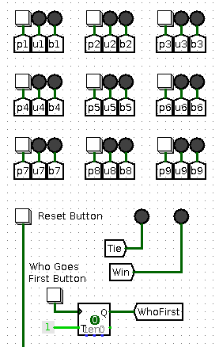

# TTL_TicTacToe

I've seen several circuits for two-player tic-tac-toe games on the Internet,
but I thought I'd try to design one with these constraints:

 + done with TTL components only, no CPU
 + minimum number of chips
 + not two player: human versus the board, board makes optimal moves

This is the repository for my result. The circuit uses flip-flops to
register both the human and the board's moves. The board has a register
which holds the current state of the board's moves. The board state and
the user's moves are combined to access a ROM to look up the next board move
and any tie or win result.
An [overview of the design](design_notes.md) is available. Here's
a [video](https://www.youtube.com/watch?v=WPPjL46z-Ag) of the board in action.

There are several versions of the design.

## Logisim Version

I built this [Logisim version](ttt_wkt.circ) in preparation for
designing the real circuit with TTL components. If you haven't used
[Logisim](http://www.cburch.com/logisim/) before, open up the _*.circ_
file. Now start the clock with a control-K (or use
_Simulate -> Ticks Enabled_). Now that the circuit is running, click on
the brown finger icon (the poke tool) at the top-left so that you can
press the game buttons.



Over on the right you will see a 3x3 grid. The white squares are the
pushbuttons to make a move. Next to each button is a red LED to register
the user's move and a blue LED for the board's moves.

Below this grid there is a Reset button and a "Who Goes First" button.
Press the "Who Goes First" button to toggle between the user moving
first and the board moving first. Then press the Reset button to clear
the board.

Now press the user moves buttons to make your moves. Immediately after
each move, the board will make a move. When a tie occurs, the Tie LED
will light up. When the board wins, the Win LED will light up.

Over on the left are the nine JK flip-flops to record the user's moves,
and the nine JK flip-flops to record the board's moves. Below that is
the ROM which generates a 4-bit value which is the new board's move.
The 4-bit board move goes into the 4:16 demultiplexer to generate the nine
lines which go to the nine JK flip-flops to record the board's moves.
Two of the 16 possible moves are used to indicate a tie or a board win.

The ROM also generates the next state of the board's moves. This is
recorded into a 4-bit register. See the [design notes](design_notes.md)
for details of the state number.

The circuit should come with the latest version of the ROM image. If you
ever regenerate the _ttt.rom_ file, here is how to load it into the circuit.
Right-click on the ROM device in the circuit and choose *Load image* and
choose the _ttl.rom_ file to load.

## Kicad Schematic

In the _Schematic/_ folder you will find a
[Kicad schematic](Schematic/schematic.pdf) for the circuit. This uses:

 + nine 74HC107 dual JK flip flops. Each one holds both the user and board
   move for one position on the board
 + one 28C256 32Kx8 EEPROM to look up the next board move. We only use
   8K of the space in the EEPROM.
 + one 74HC154 4:16 demultiplexer
 + one 75HC161 register to hold the board state number
 + one 555 to generate the clock signal
 + various LEDs to show the moves, and other sundry components.

I've also designed a [PCB](Figs/pcb1.jpg) to hold all the components.
The design has separate LEDs for user and board moves, but I've chosen to use
bi-colour LEDs so that there is a single physical LED for each board position:
green for the user, red for the board, off when empty.

## Generating the 28C256 EEPROM Contents

At the Linux command-line, run the command:

```
make
```

This will use the _gen_moves.pl_ script to generate the user-first moves file
_umoves_, and the board-first moves file _bmoves_. These are then parsed by
the _parse_moves.pl_ script to create the _ttt.rom_ file used by Logisim.

Finally, the _hex2bin_ script takes the _ttt.rom_ file, which is hex-encoded,
and converts it to the binary file _28C256.bin_ which can be burned to the
EEPROM.

If you have a MiniPro EEPROM burner and the _minipro_ command installed,

```
make write
```

will burn the _28C256.bin_ to a 28C256 chip with the MiniPro burner.
