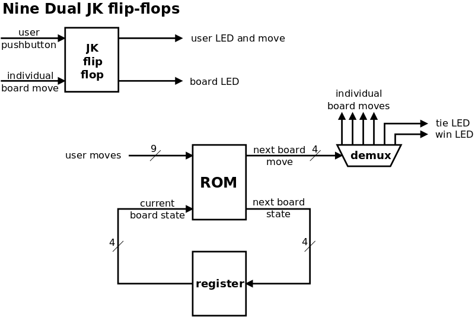

# Design Notes for the TTT Tic Tac Toe Circuit



The state of each position on the board is stored in nine dual JK flip-flops.
The user makes a move by pressing a pushbutton which is recorded in one
flip-flop. Any move made by the board is recorded in a second flip-flop.
This allows two different LEDs to be lit up: green for a user move and red
for a board move at each position. Two flip-flops also allows the board's
move as input to the user flip-flop; this prevents the user from making a
move that the board already has made.

The nine "user move" outputs provide nine bits of address into the ROM.
Four other address bits are provided by a 4-bit register. This records
a "state number" which identifies what set of "board moves" have been
made.

The ROM has 13 bits of input and 8 bits of output. Thus, it can be an 8Kx8
EEPROM. The 13-bit ROM address is used to look up the 8-bit result. Four of the
result bits are the board's next move:

 + 0 means "no move" and is used when waiting for the user to make a move
 + 1 to 9 is a legitimate next move by the board
 + 14 indicates a tie
 + 15 indicates a win by the board

This 4-bit move value goes into the 4:16 demultiplexer to produce the nine
lines that go to the nine flip-flops for the board's move. Two of the
demultiplexer lines, representing 14 and 15, go to the tie LED and board
win LED respectively.

The other four bits of the ROM result are the state number for the new
"board moves". This is recorded into the 4-bit register.

I was originally sending to the ROM nine bits of the user's moves from the user
flip-flops, and  nine bits of the board's moves from the board flip-flops.
This required a ROM with 18 bits of input, i.e. a 256Kx8 ROM. These are not
easily available.

As it turns out, for any 9-bit pattern which is the set of moves that the
user has made, there is only a handful of "board move" situations where
the user could have made this move. Therefore, these situations can be
encoded into a "state number". A state number and the 9-bit "user moves"
pattern is enough to look up the next move the board should play.

There are actually several hundred "board move" situations; I needed
to encode these into 4 bits as I was already outputting 4 bits for the
board's move. Thus, the 4-bit state number is actually a hash value;
several "board move" situations hash down to the same state number.

The constraints on choosing a state number are these:

 + a "board move" situation must always be represented by the same state number
 + any 9-bit "user moves" pattern can be associated with several
   "board move" situations. Each one must be represented with a different
   state number, so as to produce a unique ROM address

Luckily, there are a set of state numbers that satisfy these constraints.
My [parse_moves.pl](parse_moves.pl) script generates these state numbers
and the contents of the ROM.

All of the above has to be implemented with real 7400-style devices.
For the real circuit, I will use these devices:

```
28C256          A 32Kx8 EEPROM, of which we only need 8Kx8. 13 bits of
                input, 8 bits of output. 9 bits of inputs are the user's
                moves so far. 4 bits of input are the current board state
                as stored in the 74HC161 register. 4 output bits represent
                the board move (1 to 9). The other 4 output bits represent
                the next board state to put into the register. A move
                numbered 14 is a tie; a move numbered 15 is a board win.
74HC154         A 4-line to 16-line decoder/demultiplexer, inverting outputs.
                The 4-bit board move output from the ROM is wired to this.
                9 outputs are wired to the flip-flips for the X moves.
74HC161         A 4-bit register to hold the next board state from the EEPROM.
74HC107         Nine dual JK flip-flops with reset; negative-edge trigger.
555             A timer running at 100Hz or so.
```
