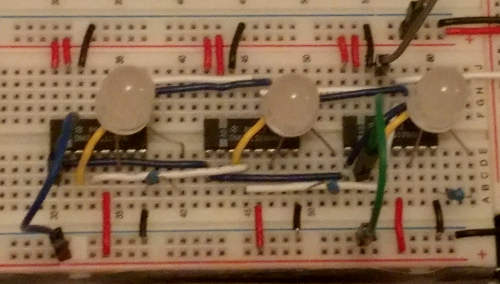

# Journal for My Tic Tac Toe in TTL Development

Here's my journal for this project. I use it to keep notes and track
my journey. It's probably not that interesting to read.

## Thu  6 Jun 09:43:35 AEST 2019

Yesterday I mused on if a game of Tic Tac Toe could be desgined with
TTL components, and how many chips it would take. After a few hours
I'd designed a working circuit in Logisim and I'd written the scripts
to generate the ROM contents so that the board would always choose the
best next move.

I also chose the ICs that I would use for a real circuit:

```
M27C2001-12F1   erasable, but discontinued. 2MB (256Kx8). 18 bits of input,
                8 bits of output. 4 output bits represent the X move, 1
                output bit is "draw", 1 output bit is "computer wins"
74HC154         4-line to 16-line decoder/demultiplexer, inverting outputs.
                The 4-bit X move output from the ROM is wired to this.
                9 outputs are wired to the flip-flips for the X moves.
74HC107         dual JK flip-flop with reset; negative-edge trigger
555             running at 100Hz or so
```

The [design notes](design_notes.md) have more information about the
overall architecture of the design of the board.

This morning I've sketched out the circuit in Kicad, roughly
arranged the components on a PCB and run freerouter to see how good/bad
the layout is. I've got only 14 or so vias, so that's not too bad.

Now I need to go back and review all the components. Example: the demux
output is active low, so I probably need to wire its outputs to the K
inputs of the J-K flip-flops.

## Thu  6 Jun 11:47:03 AEST 2019

Yes, I had to change to 74HC109 flip-flops as these have a K# input.
Now I use this to register the active-low output from the demux,
and thus I use the Q# output for the active-high registered board moves.
I got rid of some resistors for the push-buttons, and I've laid out the
PCB much more cleanly. Now running freeroute.

## Sun  9 Jun 20:39:17 AEST 2019

I'm trying a design with a smaller ROM because it's easy to get a 32Kx8 ROM
and not easy to get a 256Kx8. In this design, only the human moves go into
the ROM not the board's moves. Instead, there is a 4-bit sequence counter.
Each time the human moves, the sequence counter increments.

The idea is that, after each human move, there is one ideal board move.
So we really only need to know the current sequence number of the moves.
When we get the next human move, the set of moves and the sequence number
should determine the current state, and so we can output the best board
move and increment the sequence counter.

I was worried that I would have some metastability with the counter
and the ROM inputs/outputs, but in Logisim it seems OK. However, I'm
not generating the ROM output correctly. The circuit starts playing OK
but then goes off the rails.

It's likely that we are getting to the same state of human moves
(from several human sequences), and along the way we have chosen
different "best" board moves. And because there are different
board moves along the various paths to the current state, we are
not generating the best next move. So I will have to revisit the
ROM generation code. There is also the worry that this approach
has a gaping logical hole in it which I haven't discovered yet!

## Mon 10 Jun 09:41:06 AEST 2019

Yes a gaping hole because there are several previous states to get to the
current state. So I have an idea with parsing the "moves" file:

 + find all the win and draw states
 + work out the previous state(s) to get to them. Just use one (hopefully)
 + for each state that still hasn't got a previous one, find a previous state
 + repeat until only the empty board has no previous state.

This way, there should be only a single path from any initial move down
to the resulting win or tie.

## Tue 11 Jun 09:36:28 AEST 2019

I tried the above but I still ended up with several hundred states,
so I'd need a 9-bit state register and this would still go into the
ROM, so I'd still need the same size ROM as I had in the beginning.
So I'll give up on this avenue and go back to the original 256Kx8 ROM.

I've redone the Logisim circuit with the LEDs and buttons in a 3x3
grid at the top-right of the circuit.

## Wed 12 Jun 06:22:49 AEST 2019

Yesterday I got to Jaycar and bought the flip-flops, mux, LEDs and
resistors. Last night I started with one flip-flop and got it so it
would record a user move, a board move and stop a user changing a
board move. I've wired up three flip-flops so far:



I can't find the small pushbuttons that I know I've got somewhere.
What's concerning is that the pinout of the 74LS109 in Kicad doesn't
match the actual chip. Example: left-hand J and K# are pins 2 and 3
but Kicad has them as pins 1 and 9. I'll have to redo the pinout.
I've also ordered two M27C2001 ROMs from utsource. Until they arrive
I can either use one of the 28C256 32Kx8 EEPROMs that I have (only 15
bits or addressing), or dig out my spare 27C322 2Mx16 EPROM which I
used as the ALU in the CSCvon8. That takes 10 minutes to program
though.
